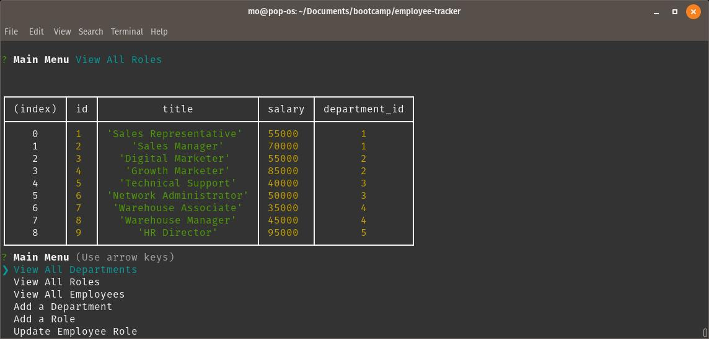

# Employee Tracker

## Description

Employee Tracker is a CLI based program that utilizes a SQL Database. Employee Tracker can:

- View an employee table
- View a department table
- View a role table
- Add a new department to the department table
- Add a new role to the role table

## Table of Contents

- [Installation](#installation)
- [Usage](#usage)
- [Credits](#Credits)
- [Questions](#questions)

## Installation

1. Prerequisite: Mysql or another sql database is already configured. The instructions will use mysql.
2. Clone the repository then run `npm install package.json` to make sure all dependencies are gotten.
3. Navigate to the DB folder.
4. Run mysql -u root -p and enter password.
5. Run `source schema.sql`.
6. (Optional) run `source seeds.sql`.

## Usage

Once the schema has been applied, you can run node index.js. Upon launching, you will be prompted with a handufl of choices. The three view options will display the tables while the add/update options will walk you through adding/altering the table.

## Credits

http://github.com/mondrovic

## Inquiries

Any questions or inquiries can go to mondrovic1@gmail.com
Matthew Ondrovic
https://githbub.com/mondrovic
